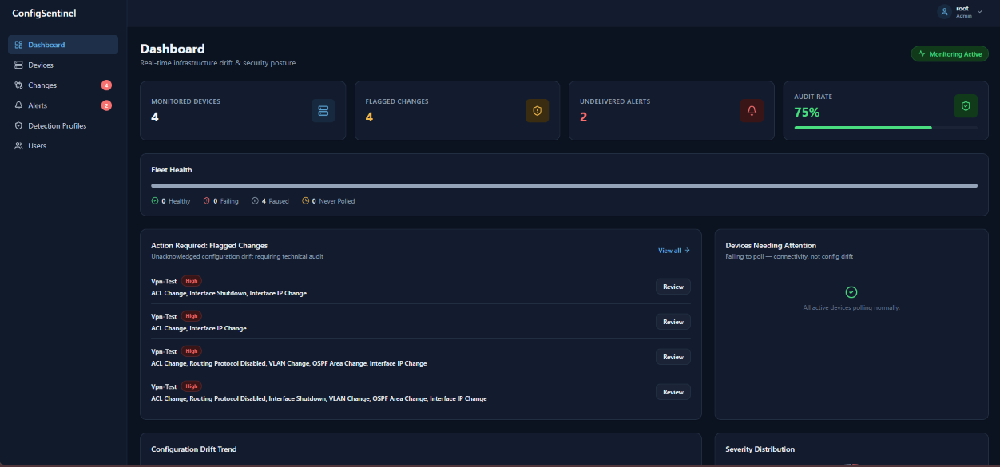
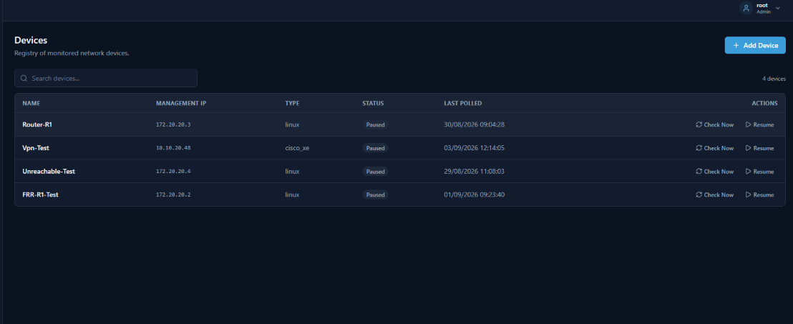
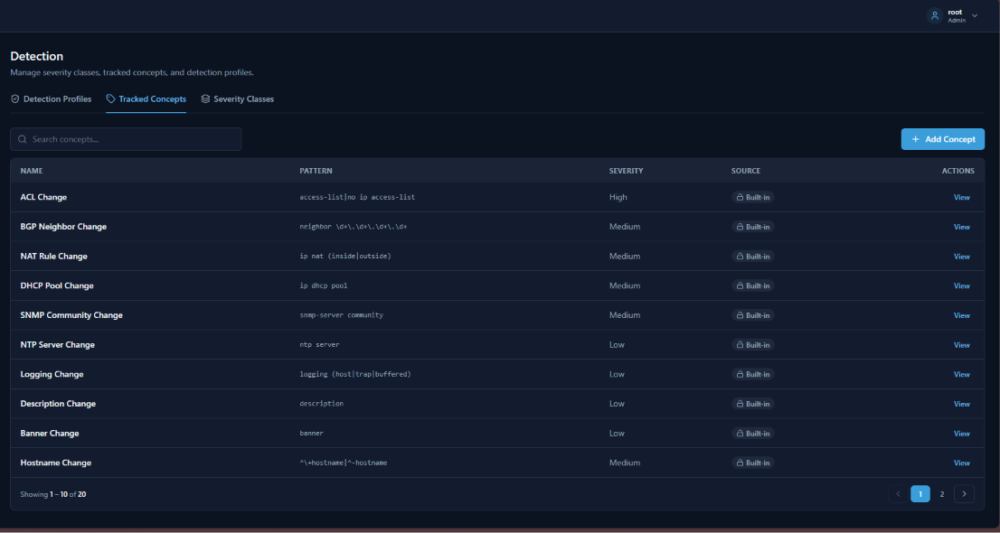
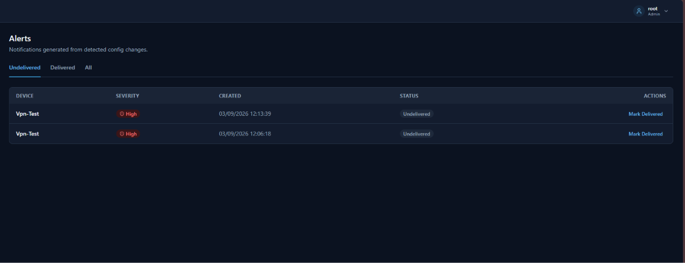

<p align="center">
  
</p>

Network configuration drift monitoring for Cisco/FRR-style devices. Polls devices over SSH, diffs configuration changes block-by-block, and flags them against a configurable rule engine — so you find out about a risky ACL edit or a disabled routing protocol without having to read a full running-config yourself.


---

## Features

- **Scheduled polling** — SSH into devices via Netmiko on a configurable interval per device
- **Structural diffing** — compares configuration block-by-block (interface, router process, ACL, etc.) instead of raw line order, so reordered-but-unchanged blocks don't produce noise
- **Configurable detection engine** — admins define what to watch for (ACL changes, routing protocol removal, interface shutdowns, VLAN changes...) without touching code
- **Severity classification** — every detection rule carries a severity tier (Low / Medium / High), rolled up per change
- **Role-based access** — Admin / Operator / Viewer roles via JWT auth
- **Acknowledge workflow** — flagged changes stay in an audit trail; acknowledging one never retroactively alters earlier diffs
- **Alerting** — in-app alerts generated for flagged changes

---

## Screenshots

<table>
  <tr>
    <td></td>
    <td></td>
  </tr>
  <tr>
    <td align="center"><sub>Dashboard</sub></td>
    <td align="center"><sub>Devices</sub></td>
  </tr>
  <tr>
    <td></td>
    <td></td>
  </tr>
  <tr>
    <td align="center"><sub>Detection profiles &amp; concepts</sub></td>
    <td align="center"><sub>Alerts</sub></td>
  </tr>
</table>

---

## Architecture

```
┌─────────────┐      ┌──────────────┐      ┌─────────────────┐
│   Vue 3     │◄────►│  Django REST │◄────►│    PostgreSQL    │
│  Frontend   │      │  Framework   │      └─────────────────┘
└─────────────┘      └──────┬───────┘
                             │
                      ┌──────▼───────┐      ┌─────────────────┐
                      │    Celery    │◄────►│      Redis       │
                      │   (polling)  │      │  (broker/queue)  │
                      └──────┬───────┘
                             │ SSH (Netmiko)
                      ┌──────▼───────┐
                      │   Network    │
                      │   Devices    │
                      └──────────────┘
```

**Stack:** Django + Django REST Framework · Celery · Netmiko · PostgreSQL · Redis · Vue 3 · TypeScript · Docker

---

## Installation

### Prerequisites

- Docker and Docker Compose installed
- Git

### 1. Clone the repo

```bash
git clone https://github.com/<your-username>/ConfigSentinel.git
cd ConfigSentinel
```

### 2. Configure environment variables

Copy the example env file and fill in your own values:

```bash
cp Backend/.env.example Backend/.env
```

At minimum, set:

```env
DJANGO_SECRET_KEY=<generate one>
FERNET_KEY=<generate one — see below>
POSTGRES_DB=configsentinel
POSTGRES_USER=configsentinel
POSTGRES_PASSWORD=<your choice>
```

Generate a Fernet key (used to encrypt device SSH credentials at rest) with:

```bash
python -c "from cryptography.fernet import Fernet; print(Fernet.generate_key().decode())"
```

### 3. Build and start the containers

```bash
docker compose up -d --build
```

This starts the Django backend, Celery worker, PostgreSQL, Redis, and the Vue frontend.

### 4. Run migrations

Migrations run the schema setup **and** seed the built-in detection rules (`TrackedConcept`s) and severity tiers automatically — no separate seed step needed.

```bash
docker compose exec django python manage.py migrate
```

### 5. Create an admin user

```bash
docker compose exec django python manage.py createsuperuser
```

### 6. Open the app

- Frontend: [http://localhost:5173](http://localhost:5173)
- API: [http://localhost:8000/api/](http://localhost:8000/api/)
- Django admin: [http://localhost:8000/admin/](http://localhost:8000/admin/)

Log in with the superuser account you just created, then add your first device under **Devices**.

---

## Adding a device

1. Go to **Devices → Add Device**
2. Fill in the device's management IP, SSH credentials, and device type
3. Optionally assign a **Detection Profile** (a named set of rules to watch for on this device)
4. Save, then click **Check Now** to run an immediate poll, or wait for the scheduled interval

> **Note:** Currently supports Cisco IOS/IOS-XE and FRR (via `vtysh`) syntax. See [Design Notes](#design-notes--tradeoffs) below.

---

## Design Notes & Tradeoffs

**Regex-based detection rules, not a structured config parser.** Detection rules match against formatted diff text rather than a fully parsed, typed representation of device state. This means new rules can be added by an admin at runtime with zero code changes or redeploys — but it also means a rule occasionally has to key off diff-formatting side effects (e.g. detecting a removed routing protocol by matching the `-router ospf` line a diff tool produces, rather than checking a structured "protocol removed" event directly). A fully structured/typed config model would be more semantically precise, at the cost of losing runtime-configurable rules without also building a small rule DSL on top.

**Chained snapshot diffing, not diff-against-baseline.** Every snapshot diffs against its immediate predecessor, not a movable "last approved" pointer. This preserves a permanent audit trail — acknowledging a change never retroactively alters an earlier diff. A separate `baseline` concept exists for "what's changed since the last known-good state" use cases.

**Scoped to Cisco/FRR-style syntax.** The parser assumes `!`-delimited, indentation-based config blocks. A device with a fundamentally different format (e.g. Juniper's brace-delimited style) isn't supported without a separate parser.

---

## Known Limitations

- No CI/CD pipeline yet
- Single detection-syntax family (Cisco IOS/IOS-XE, FRR) — no Juniper/brace-style support
- Enable-mode credentials assume the same password as SSH login unless a distinct `enable_secret` is explicitly set per device

---

## License

<!-- e.g. MIT — add a LICENSE file if you want one -->
