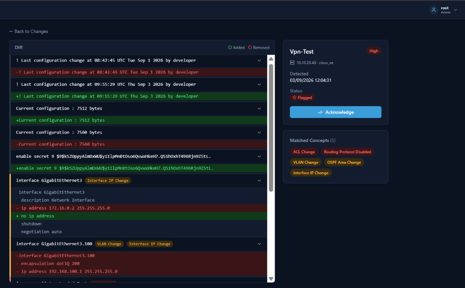
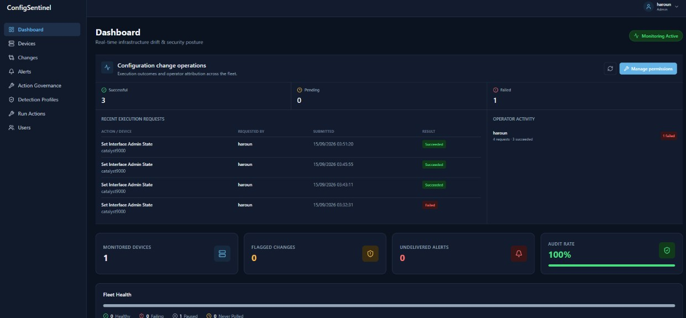
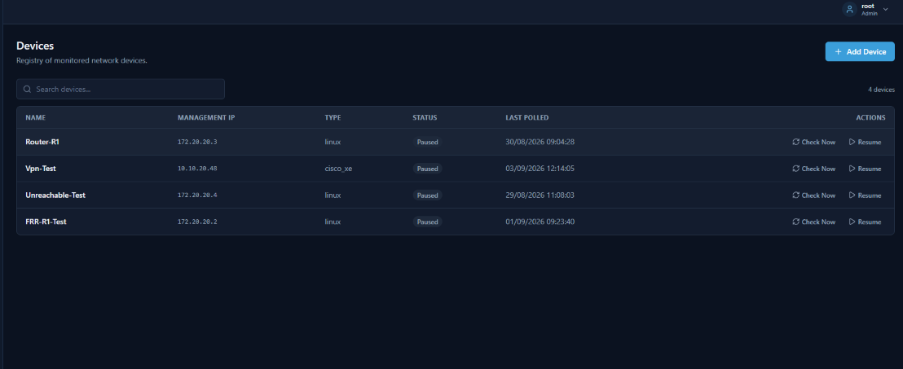
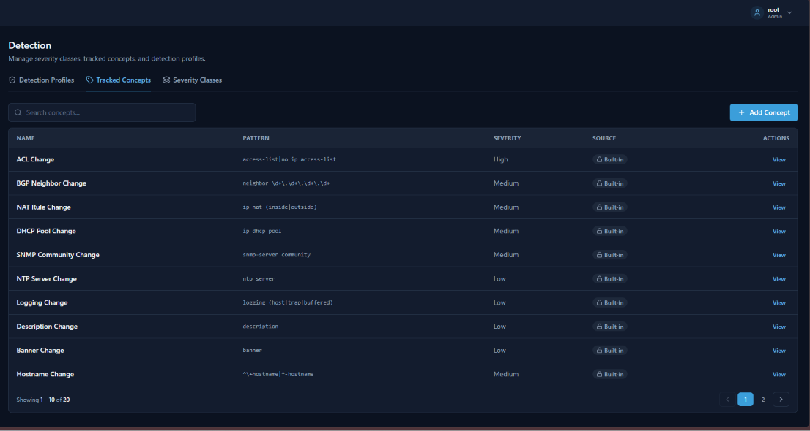
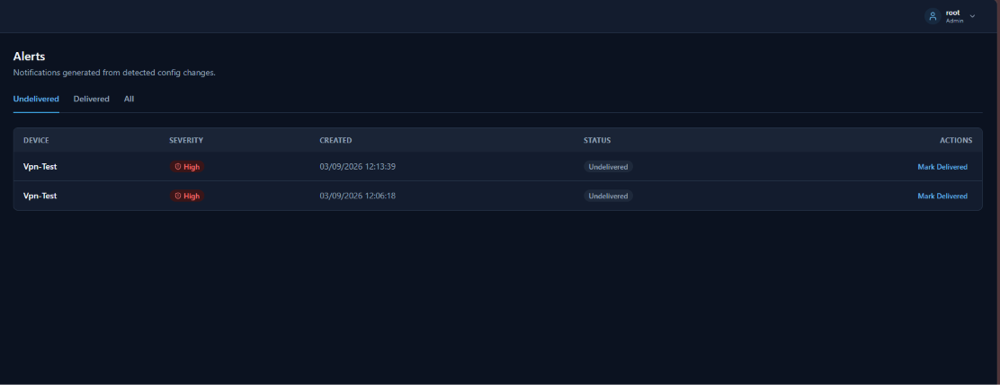
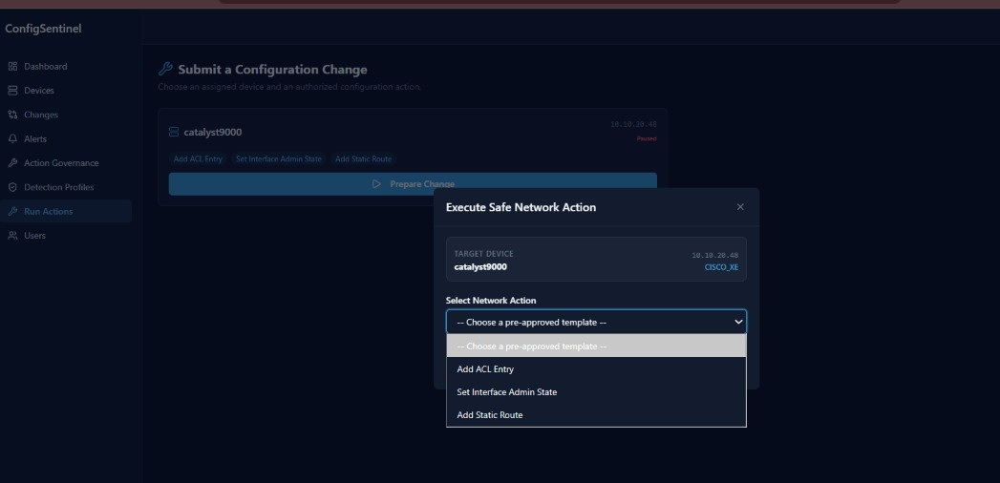
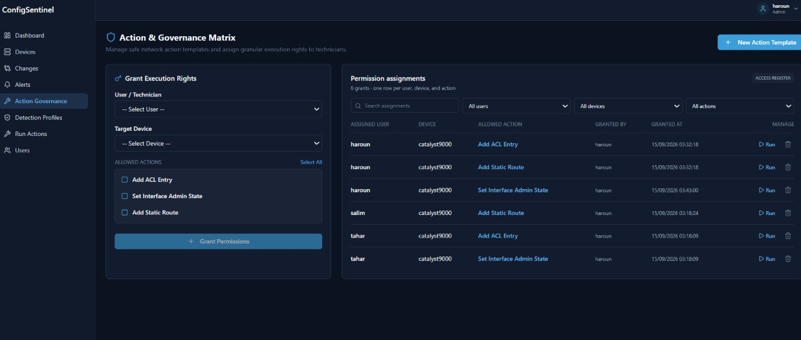

<p align="center">
  
</p>

Network configuration drift monitoring **and safe, audited change management** for Cisco/FRR-style devices. ConfigSentinel polls devices over SSH, diffs configuration changes block-by-block, and flags them against a configurable rule engine — so you find out about a risky ACL edit or a disabled routing protocol without having to read a full running-config yourself. Technicians can also push pre-approved changes back to devices through the app itself, instead of a raw CLI session, with permissions, a command preview, and verification that the change actually landed.

Validated against an FRRouting lab (Containerlab) and a real Cisco Catalyst 8000V (IOS-XE) over VPN via the Cisco DevNet sandbox.



---

## Features

**Monitoring**
- **Scheduled polling** — SSH into devices via Netmiko on a configurable interval per device
- **Structural diffing** — compares configuration block-by-block (interface, router process, ACL, etc.) instead of raw line order, so reordered-but-unchanged blocks don't produce noise
- **Configurable detection engine** — admins define what to watch for (ACL changes, routing protocol removal, interface shutdowns, VLAN changes...) without touching code
- **Severity classification** — every detection rule carries a severity tier (Low / Medium / High), rolled up per change
- **Acknowledge workflow** — flagged changes stay in an audit trail; acknowledging one never retroactively alters earlier diffs. Acknowledging is Admin-only — operators can act on devices, but the final review call belongs to an admin
- **Alerting** — in-app alerts generated for flagged changes

**Change management**
- **Pre-approved action templates** — admins define reusable actions (e.g. "Add ACL Entry") as Jinja2 CLI templates per device type, with typed, validated parameters
- **Fine-grained, per-operator permissions** — permissions are assigned individually, not as a fixed role: an admin builds each operator's access one grant at a time (this user, this device, this action), so two operators can end up with entirely different sets of allowed actions and devices based on what they've actually been granted
- **Review before execute** — submitting an action renders the exact CLI commands for review; nothing is sent to the device until the technician explicitly confirms
- **Honest execution results** — the device's own CLI output is checked for rejections (invalid/incomplete/ambiguous commands), not just the absence of a network error, so a rejected command is correctly reported as failed with the device's real error message
- **Post-change verification** — after a successful push, the device is automatically re-polled; if no configuration change is actually visible afterward, the request is flagged as unverified rather than silently trusted
- **Full audit trail** — every change request records who requested it, what was sent, and the outcome; every resulting config change links back to the request that caused it (or is marked as an out-of-band change if it wasn't triggered by the app)

**Platform**
- **Role-based access** — Admin / Operator roles via JWT auth
- **Encrypted credentials at rest** — device SSH credentials are encrypted (Fernet), not stored in plaintext

---

## Screenshots

<table>
  <tr>
    <td></td>
    <td></td>
  </tr>
  <tr>
    <td align="center"><sub>Dashboard</sub></td>
    <td align="center"><sub>Devices</sub></td>
  </tr>
  <tr>
    <td></td>
    <td></td>
  </tr>
  <tr>
    <td align="center"><sub>Detection profiles &amp; concepts</sub></td>
    <td align="center"><sub>Alerts</sub></td>
  </tr>
  <tr>
    <td></td>
    <td></td>
  </tr>
  <tr>
    <td align="center"><sub>Running a pre-approved action (CLI preview)</sub></td>
    <td align="center"><sub>Action &amp; permission governance</sub></td>
  </tr>
</table>

---

## Architecture

```
┌─────────────┐      ┌──────────────┐      ┌─────────────────┐
│   Vue 3     │◄────►│  Django REST │◄────►│    PostgreSQL    │
│  Frontend   │      │  Framework   │      └─────────────────┘
└─────────────┘      └──────┬───────┘
                             │
                      ┌──────▼───────┐      ┌─────────────────┐
                      │    Celery    │◄────►│      Redis       │
                      │ (polling +   │      │  (broker/queue)  │
                      │  execution)  │      └─────────────────┘
                      └──────┬───────┘
                             │ SSH (Netmiko)
                      ┌──────▼───────┐
                      │   Network    │
                      │   Devices    │
                      └──────────────┘
```

Polling and command execution both run as Celery tasks over Netmiko, so the API never blocks on a live SSH session. A successful push automatically queues a follow-up poll on the same device to verify the change actually landed — see [Design Notes](#design-notes--tradeoffs).

**Stack:** Django + Django REST Framework · Celery · Netmiko · PostgreSQL · Redis · Vue 3 · TypeScript · Docker

---

## Installation

### Prerequisites

- Docker and Docker Compose installed
- Git

### 1. Clone the repo

```bash
git clone https://github.com/haroun-messaoudi/ConfigSentinel.git
cd ConfigSentinel
```

### 2. Configure environment variables

Copy the example env file and fill in your own values:

```bash
cp Backend/.env.example Backend/.env
```

At minimum, set:

```env
SECRET_KEY=<generate one>
FERNET_KEY=<generate one — see below>
POSTGRES_DB=configsentinel
POSTGRES_USER=configsentinel
POSTGRES_PASSWORD=<your choice>
```

Generate a Fernet key (used to encrypt device SSH credentials at rest) with:

```bash
python -c "from cryptography.fernet import Fernet; print(Fernet.generate_key().decode())"
```

### 3. Build and start the containers

```bash
docker compose up -d --build
```

This starts the Django backend, Celery worker, PostgreSQL, Redis, and the Vue frontend.

### 4. Run migrations

Migrations run the schema setup **and** seed the built-in detection rules (`TrackedConcept`s) and severity tiers automatically — no separate seed step needed.

```bash
docker compose exec django python manage.py migrate
```

### 5. Create an admin user

```bash
docker compose exec django python manage.py createsuperuser
```

### 6. Open the app

- Frontend: [http://127.0.0.1:5173](http://127.0.0.1:5173)
- API: [http://127.0.0.1:8000/api/](http://127.0.0.1:8000/api/)
- Django admin: [http://127.0.0.1:8000/admin/](http://127.0.0.1:8000/admin/)

Log in with the superuser account you just created, then add your first device under **Devices**.

---

## Adding a device

1. Go to **Devices → Add Device**
2. Fill in the device's management IP, SSH credentials, and device type
3. Optionally assign a **Detection Profile** (a named set of rules to watch for on this device)
4. Save, then click **Check Now** to run an immediate poll, or wait for the scheduled interval

> **Note:** Currently supports Cisco IOS/IOS-XE and FRR (via `vtysh`) syntax. See [Design Notes](#design-notes--tradeoffs) below.

## Running a pre-approved action

1. As an admin, go to **Action & Governance Matrix** to define an action template (name, parameters, and a Jinja2 CLI template per device type it should support)
2. Grant a user permission to run that action on a specific device
3. As that user, go to **Run Actions**, pick the device and action, fill in the parameters, and review the generated CLI commands
4. Confirm — the command is sent, checked for CLI-level rejection, and (once accepted) verified with a follow-up poll. The change request's status and the device's own response are both visible once the check completes

---

## Design Notes & Tradeoffs

**Regex-based detection rules, not a structured config parser.** Detection rules match against formatted diff text rather than a fully parsed, typed representation of device state. This means new rules can be added by an admin at runtime with zero code changes or redeploys — but it also means a rule occasionally has to key off diff-formatting side effects (e.g. detecting a removed routing protocol by matching the `-router ospf` line a diff tool produces, rather than checking a structured "protocol removed" event directly). A fully structured/typed config model would be more semantically precise, at the cost of losing runtime-configurable rules without also building a small rule DSL on top.

**Chained snapshot diffing, not diff-against-baseline.** Every snapshot diffs against its immediate predecessor, not a movable "last approved" pointer. This preserves a permanent audit trail — acknowledging a change never retroactively alters an earlier diff. A separate `baseline` concept exists for "what's changed since the last known-good state" use cases.

**CLI-rejection detection, not just absence of a network error.** Command execution used to assume success whenever the SSH session itself didn't error out — meaning a device that rejected a command (e.g. a routing command on a Layer-2-only switch) still got reported as a success. Netmiko's `send_config_set` is now called with an `error_pattern` that matches standard CLI rejection prefixes, so a rejected command raises immediately and the change request is marked failed with the device's actual response.

**Post-change verification is advisory, not authoritative.** After a successful push, the app re-polls the device and checks for a visible config diff. If nothing changed, the change request isn't flipped to "failed" — an idempotent command (one that was already applied) can legitimately produce no diff — but it is annotated as unverified so a human can double check. The CLI-rejection check above remains the authoritative pass/fail signal; the verification poll only catches the rarer case of a command the CLI silently accepted but that didn't actually take effect.

**Scoped to Cisco/FRR-style syntax.** The parser assumes `!`-delimited, indentation-based config blocks, and the CLI-rejection pattern assumes Cisco/FRR-style error prefixes. A device with a fundamentally different format (e.g. Juniper's brace-delimited style) isn't supported without a separate parser and rejection pattern.

---

## Known Limitation
- Single detection-syntax family (Cisco IOS/IOS-XE, FRR) — no Juniper/brace-style support
---
